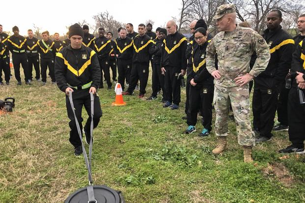
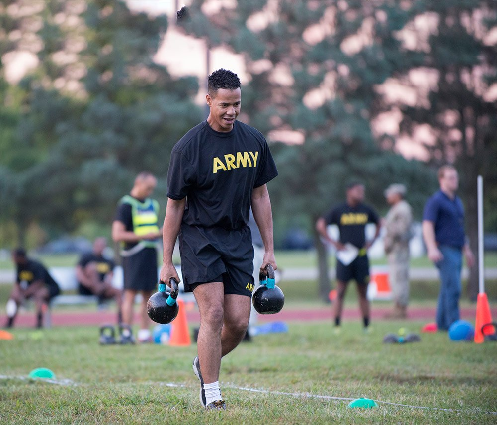
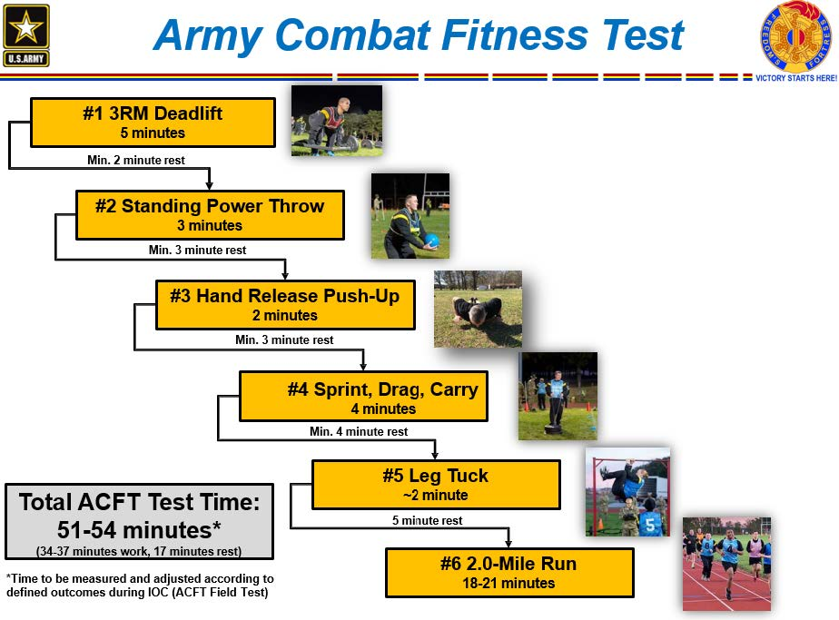

autoscale: true
theme: Ostrich,3

# ACFT
## THE ARMY **COMBAT FITNESS** TEST

---

## Agenda

- What is the ACFT?
- Why did the test change?
- The events
- How to prepare for it

---

# WHAT IS THE **ACFT**?

---

##  WHAT IS THE **ACFT**?

- A **6-event** test designed to inform commanders of their unit's ability to meet physical demands faced in **combat**
 - 10 minute preparation drill
 - 10 minute warmup for 3RM Deadlift
 - 3RM Deadlift
 - Standing Power Throw
 - Hand Release Push Up
 - Sprint, Drag, Carry
 - Leg Tuck
 - 2-mile Run

---

---

##  WHAT IS THE **ACFT**?

- Test is age and gender agnostic
- Based on physical demands of unit/MOS
 - Moderate, Significant, Heavy
 - OPAT is a precursor, but will not go away
- Alternate events have not yet been identified

---

## WHAT IS THE **ACFT**?

- The ACFT will be performed diagnostically during FY 19.
- It will replace the APFT beginning in FY 21.
- 

