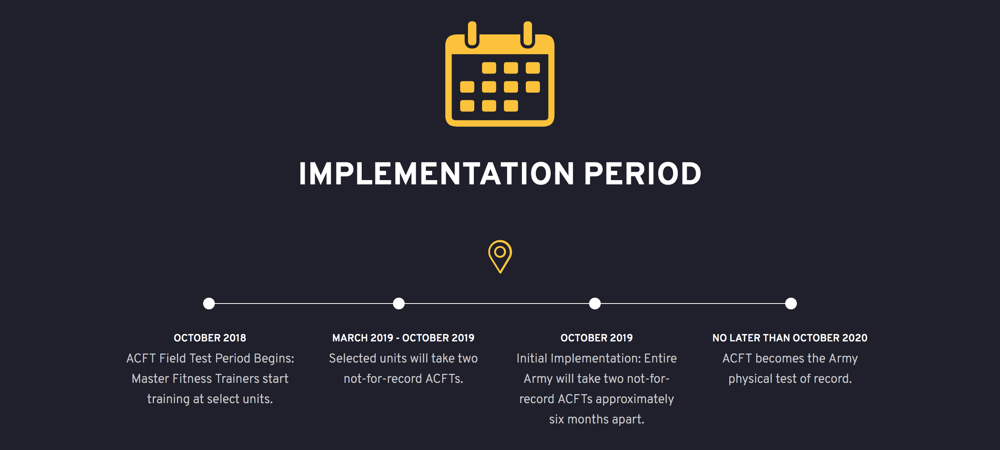

autoscale: true
theme: Chris Titillium

# ARMY **COMBAT FITNESS** TEST

SFC DEATON - MFT, ACFT II

---

# THE AGENDA

- Why are we switching?
- What is the ACFT?
- When will it be implemented?
- How do I prepare?
- Frequently Asked Questions

---

# WHY WE ARE SWITCHING

- The APFT is over **40 years old**.
- Not an effective measurement of overall fitness.
  - Primarily muscular and aerobic endurance
  - **40%** predictive success vs ACFT **80%** predictive

---

WHY WE ARE SWITCHING

- Overall fitness is comprised of many other components
  - Muscular strength and endurance
  - Power, Speed, Agility
  - Balance, flexibility
  - Cardio endurance

---

WHY WE ARE SWITCHING

- Improve soldier and unit readiness
- Transform the Army's fitness culture
- Reduce preventable injuries and attrition
- Enhance mental toughness and stamina

---

# WHAT IS THE **ACFT**

---

WHAT IS THE **ACFT**

- A **6-event** total body fitness test designed to inform commanders of their unit's ability to meet physical demands faced in **combat**
 - 3RM Deadlift
   - 10 minute warmup period
   - 2 attempts allowed, 1 fault per attempt
   - 2 minutes of rest
   - 140, 160, 180, 340
 - Standing Power Throw
   - 1 practice throw, 2 attempts
   - 3 counter-movements
   - Heels cannot pass the throw line
   - Measured where the ball strikes the ground
   - 3 minutes of rest
 - Hand Release Push Up
   - Index fingers no further than the outside of the shoulder
   - Natural spine alignment (don't look up)
   - Rest only in the front-leaning rest
   - 3 minutes of rest
   - 10, 20, 30, 70
 - Sprint, Drag, [lateral], Carry
   - 4 minutes of rest
 - Leg Tuck
   - Cannot be spotted
   - Both knees must touch both elbows
   - Dominant hand nearest you (suggested)
   - 5 minutes of rest
   - 1, 3, 5, 20
 - 2-mile Run

---

---

WHAT IS THE **ACFT**

- Test is age AND gender agnostic
- Based on physical demands of unit/MOS
  - Moderate, Significant, Heavy
  - OPAT is a precursor, but will not go away

---

## IMPLEMENTATION PERIOD

---

---

# HOW DO I **PREPARE**?
### ARMY COMBAT FITNESS TEST

---

# HOW DO I PREPARE?

- Physical readiness training
 - DO IT AT HOME!
 - **Correct form and cadence**
   - PRT helps you instill proper lifting techniques
 - Don't stop at CD1
   - STC, HSD, SSD, CL1/2, CD2, CD3
   - PRT App
- Training specificity
 - Hypertrophy, strength workouts
 - Proper work/rest ratios
- Proper diet and nutrition
 - Myfitnesspal - track what you eat, and stick with it!
 - Carbs, sugars, fats don't make you fat. Calories do.
 - Tactical athletes should consume between .7g-1g of protein per pound of body weight
